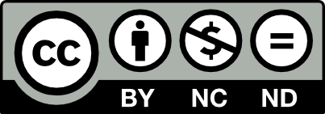

# Monerpy - Personal Finance Management Tool [](https://app.devin.ai/wiki/Sergio-D-Vico-Pineda/Monerpy)

## 1. Project

**Monerpy** is a comprehensive personal finance management web application designed to help users track their income, expenses, and financial goals. The application provides an intuitive dashboard with calendar views, transaction categorization through groups, recurring transaction management, and detailed financial analytics.

Built with modern web technologies, Monerpy offers a responsive and user-friendly interface for managing personal finances with features like transaction grouping, recurring payments tracking, and comprehensive reporting capabilities.

## 2. Screenshots or Demos

*Screenshots and demo links would be added here once available*

## 3. Installation Instructions

### Prerequisites
- Node.js (version 18 or higher)
- npm

### Dependencies Installation

```bash
# Clone the repository
git clone https://github.com/Sergio-D-Vico-Pineda/Monerpy.git
cd Monerpy

# Install dependencies and initialize the database
npm run init
```

This command will install all dependencies and generate the Prisma client for database operations.

## 4. Usage Instructions

### Development Server

```bash
# Start development server
npm run dev

# Start development server with network access
npm run deve

# Build for production
npm run build

# Preview production build
npm run preview
```

The application will be available at `http://localhost:4321` in development mode.

### Basic Usage
1. Register a new account or login with existing credentials
2. Access the dashboard to view monthly financial overview
3. Add income and expense transactions using the quick actions
4. Create transaction groups to categorize your finances
5. Set up recurring transactions for regular payments
6. View transaction calendar for daily financial activity

## 5. Project Structure

```
Monerpy/
├── db/                     # Database files
├── prisma/                 # Database schema and migrations
├── src/                    # Source code
│   ├── components/         # Reusable UI components
│   ├── lib/               # Utility libraries
│   ├── middleware/        # Authentication middleware
│   ├── pages/             # Astro pages and API routes
│   └── types/             # TypeScript type definitions
├── package.json           # Project dependencies
├── tsconfig.json          # TypeScript configuration
└── README.md              # Project documentation
```

### Key Directories

**Pages Structure:**
- `api/` - Backend API endpoints
- `profile/` - User profile management
- `recurring-transactions/` - Recurring transaction management
- `transaction-groups/` - Transaction category management
- `transactions/` - Transaction CRUD operations

## 6. Technologies Used

### Core Technologies

- **Frontend Framework:** Astro  with TypeScript
- **Styling:** TailwindCSS 4
- **Database:** SQLite with Prisma ORM 6
- **Authentication:** Custom session-based auth with bcryptjs
- **Deployment:** Vercel (@astrojs/vercel adapter)

### Database Configuration

The application uses SQLite as the database with Prisma as the ORM, providing a lightweight and efficient data storage solution.

## 7. API Documentation

### Authentication Endpoints

The API includes the following endpoint categories:
- `auth/` - User authentication (login/logout)
- `calendar/` - Calendar data for dashboard
- `transactions/` - Transaction CRUD operations
- `recurring-transactions/` - Recurring transaction management
- `transaction-groups/` - Transaction category management
- `user/` - User profile management

### Authentication System

The application uses session-based authentication with configurable session duration (24 hours standard, 30 days for "remember me" option).

## 8. Testing

*Testing framework information would be added here once implemented*

Currently, the project doesn't include a specific testing framework, but this would be a recommended addition for future development.

## 9. Deployment Instructions

### Vercel Deployment

The project is configured for Vercel deployment using the official Astro Vercel adapter.

```bash
# Build for production
npm run build

# Deploy to Vercel (requires Vercel CLI)
vercel deploy
```

### Environment Setup
Ensure proper environment variables are configured for:
- Database connection string
- Session secrets

## 10. Contribution Guidelines

### Code Style

The project uses TypeScript with strict configuration and custom path aliases for better code organization:
- Use TypeScript for all new code
- Follow the established path alias patterns (@/, @comps/, @layouts/, etc.)
- Maintain consistent code formatting

### Development Workflow
1. Fork the repository
2. Create a feature branch
3. Follow the existing code structure and conventions
4. Test thoroughly before submitting
5. Submit a pull request with clear description

## 11. Authors and Credits

**Author:**
- **Name:** Scarpy19
- **Email:** servicpin2@alu.edu.gva.es
- **GitHub:** [Scarpy19](https://github.com/Scarpy19)

### Planned Features

Future enhancements may include:
- Rate limiting for API endpoints
- Transaction amount limits/approvals  
- Two-factor authentication for large transactions
- IP-based access controls
- Enhanced audit logging

## License

This documentation is based on the current state of the Monerpy project. The application is in slow development (version 0.0.1), and some features mentioned in the database schema may not yet have complete UI implementations. The project follows modern web development practices with a focus on TypeScript, responsive design, and user experience.




<a href="https://github.com/Sergio-D-Vico-Pineda/Monerpy">Monerpy</a> © 2025 by <a href="https://github.com/Sergio-D-Vico-Pineda">Scarpy19</a> is licensed under <a href="https://creativecommons.org/licenses/by-nc-sa/4.0/">CC BY-NC-SA 4.0</a>

Favicon.png Image from Dead Cells by Motion Twin, licensed under CC BY-NC-SA 4.0
